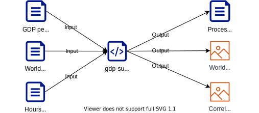

# Influence of sunshine on GDP per capita

This paper explores the hypothesis that dreary weather discourages people from going outside and in turn makes them more productive. Likewise, that beautiful weather outside distracts people from their work, which should reflect in a country's GDP per capita. We use some basic statistical indicators to show that further exploration of this topic is a valid research path, but better-quality weather data is needed to make conclusions.

## Authors
[Filip Darmanovic](https://orcid.org/0000-0002-2239-1634)

## Folder structure
- 📂 `documentation` - Documentation, Metadata etc.
- 📂 `input_data` - Raw input datasets
    - 📂 `API_NY.GDP.PCAP.CD_DS2_en_csv_v2_2163510` - WorldBank GDP per Capita dataset
    - 📂 `ne_10m_admin_0_countries` - Country borders geodata
    - 📜 `Cities by Sunshine Duration.xlsx` - Average sunshine duration dataset
- 📂 `output` - Folder containing output artifacts
    - 📜 `gdp_sunshine.csv` - Data processing pipeline output, base for PDF visualizations
    - 📜 `sunshine_gdp_corr.pdf` - Vector visualization of correlation between columns in `gdp_sunshine.csv` 
    - 📜 `sunshine_gdp_world.pdf` - Vector visualization with color-coded countries based on sunshine and GDP per capita
- 📓 `gdp-sunshine.ipynb` - Jupyter notebook containing all of the experiment's code
- 📜 `Pipfile` - Used by `pipenv` for managing python dependencies
- 📜 `Pipfile.lock` - Used by `pipenv` for reproducing the test environment
- 📜 `README.md` - This file

## Reproducing the experiment
### Prerequisites
1. `python3`
2. `pip`
3. `pipenv`

### Running the code
Execute the following steps to start the notebook in the test environment:
1. `pipenv install` - Installs needed dependencies into a separate python virtualenv
2. `pipenv shell` - Switches to the created virtualenv
3. `jupyter notebook` - Runs a notebook server
4. Select the notebook and run all cells

## Data Flow
